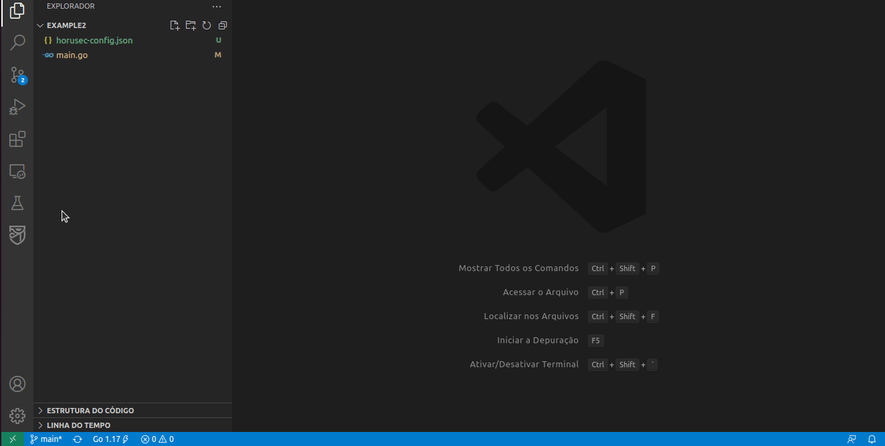

<p></p>
<p></p>
<p align="center" margin="20 0"><a href="https://horusec.io/"></a></p>
<p></p>
<p></p>

# **Horusec-Extensions**

## **Table of contents**
### 1. [**About**](#about)
### 2. [**Usage**](#usage)
### 3. [**Documentation**](#documentation)
### 4. [**Issues**](#issues)
### 5. [**Contributing**](#contributing)
### 6. [**License**](#license)
### 7. [**Community**](#community)


## **About**

This repository contains a [**Horusec CLI**](https://github.com/ZupIT/horusec) extension for the integrated development environment (IDE) **Visual Studio Code**. With this extension, you will be able to perform a static code analysis (SAST) in search of vulnerabilities.

## **Usage**

### Requirements

You must have [**Docker**](https://www.docker.com/) installed, click [**here**](https://github.com/ZupIT/horusec#requirements) to check more detailed information about **Horusec-CLI** requirements.

**Note:** The analysis works using Horusec docker image, if you use the [**disable docker**](https://docs.horusec.io/docs/tutorials/how-to-use-horusec-without-docker/) option, 
Horusec only will execute the [**Horusec tools**](https://docs.horusec.io/docs/cli/analysis-tools/overview/#horusecs-tools), therefore, you need the Docker installed for analysis works properly.

### Executing an analysis

In the **Visual Studio Code** sidebar, click on the Horusec extension icon, then click on **Start analysis** button. To stop the analysis, you can click on the **Horusec stop** button.

**Note:** If there is no path configured, the workspace path of the IDE will be analyzed.



### Configuration

In this extension, we use a configuration file to customize Horusec usage. You can make this changes using the settings button, `F1` or directly on the [**config file**](https://docs.horusec.io/docs/cli/commands-and-flags/#1-configuration-file). All possible configs start with the `horusecCli` prefix.

## **Documentation**

For more information about Horusec, please check out the [**documentation**](https://docs.horusec.io/docs/overview).

## **Issues** 

To open or track an issue for this project, in order to better coordinate your discussions, we recommend that you use the [**Issues tab**](https://github.com/ZupIT/horusec/issues) in the main [**Horusec-CLI**](https://github.com/ZupIT/horusec) repository.

## **Contributing**

If you want to contribute to this repository, access our [**Contributing Guide**](https://github.com/ZupIT/horusec-vscode-plugin/blob/main/CONTRIBUTING.md). 


### **Developer Certificate of Origin - DCO**

 This is a security layer for the project and for the developers. It is mandatory.
 
 Follow one of these two methods to add DCO to your commits:
 
**1. Command line**
 Follow the steps: 
 **Step 1:** Configure your local git environment adding the same name and e-mail configured at your GitHub account. It helps to sign commits manually during reviews and suggestions.

 ```
git config --global user.name “Name”
git config --global user.email “email@domain.com.br”
```
**Step 2:** Add the Signed-off-by line with the `'-s'` flag in the git commit command:

```
$ git commit -s -m "This is my commit message"
```

**2. GitHub website**
You can also manually sign your commits during GitHub reviews and suggestions, follow the steps below: 

**Step 1:** When the commit changes box opens, manually type or paste your signature in the comment box, see the example:

```
Signed-off-by: Name < e-mail address >
```

For this method, your name and e-mail must be the same registered on your GitHub account.

## **License**
[**Apache License 2.0**](https://github.com/ZupIT/horusec-vscode-plugin/blob/main/LICENSE).

## **Community**
Do you have any question about Horusec? Let's chat in our [**forum**](https://forum.zup.com.br/).


This project exists thanks to all the contributors. You rock! ❤️🚀
